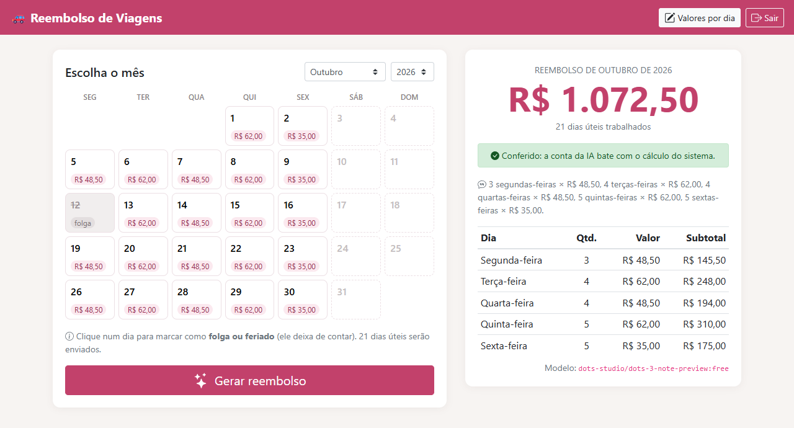
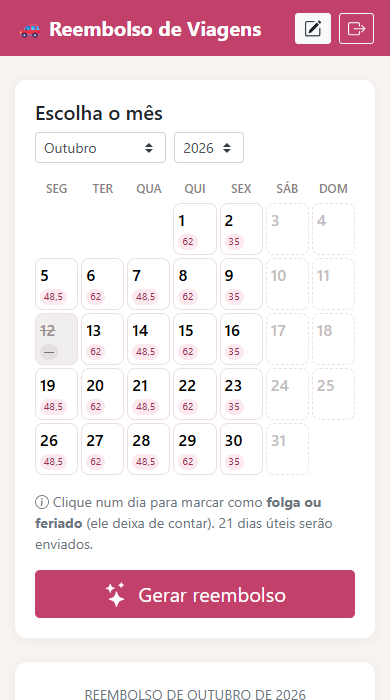
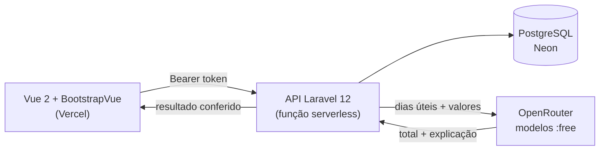

<div align="center">

# 🚗 Reembolso de Viagens

**Marque as folgas no calendário e saiba em segundos quanto a empresa te deve pelas viagens do mês.**


[**Abrir o sistema**](https://reembolso-viagens.vercel.app) · [API](https://reembolso-viagens-api.vercel.app) · [Reportar bug](../../issues)

</div>

---

Quem viaja a trabalho com o próprio carro conhece o ritual do fim do mês: contar quantas
segundas, terças e quartas caíram no calendário, descontar o feriado, multiplicar cada dia
por um valor diferente e torcer para não errar a conta antes de mandar para o RH.

Aqui a pessoa configura **uma vez** quanto a empresa paga em cada dia da semana, clica nos
dias de folga e aperta **Gerar**. Um modelo de IA gratuito faz o cálculo e explica como
chegou no valor, e o backend refaz a conta para garantir que o número está certo.

<p align="center">
  
  &nbsp;
  
</p>

<p align="center"><sub>Outubro/2026 com o feriado do dia 12 marcado: 21 dias úteis, R$ 1.072,50, conta da IA conferida.</sub></p>

## O que ele faz

- **Calendário que já sabe os dias úteis.** O mês aparece com o valor de cada dia, e feriado
  ou folga sai da conta com um clique.
- **A IA calcula, o sistema confere.** O modelo devolve o total e a explicação, e o backend
  refaz a soma por conta própria. Se a IA errar, a tela mostra o valor correto e avisa. Nos
  testes, um modelo de 2,6 bilhões de parâmetros respondeu R$ 405 onde o certo era R$ 395, e
  a conferência pegou.
- **Custo zero de IA sem ficar fora do ar.** Usa só modelos gratuitos do OpenRouter, com
  lista de reserva: se um estiver sem cota, o próximo responde.
- **Cada pessoa com a sua conta.** Cadastro aberto, senha com bcrypt, token com validade de
  7 dias e limite de tentativas no login e no cadastro.
- **Feito para usar no celular.** O calendário fica compacto e o layout se reorganiza em
  telas de 390 px.
- **R$ 0 de infraestrutura.** Site e API na Vercel (Hobby), Postgres no Neon (free), e as
  tabelas se criam sozinhas no primeiro acesso.

## Como funciona



O backend calcula os dias úteis do mês, monta o prompt com a lista de datas e os valores,
pede ao modelo uma resposta em JSON estrito e compara o total recebido com a própria soma.
O front só exibe: quem decide o número final é o servidor.

## Decisões técnicas

**Não confiar cegamente no LLM.** O `ReembolsoService` extrai o JSON da resposta mesmo
quando o modelo devolve markdown em volta e marca `confere: false` se o total divergir do
cálculo local. A IA explica, o sistema garante.

**Autenticação sem estado para serverless.** Na Vercel não existe sessão entre uma
invocação e outra. O `TokenService` emite um token `{id, expira}` cifrado com AES-256 pela
`APP_KEY`: sem tabela de tokens e sem Redis. O login roda `Hash::check` mesmo quando o
e-mail não existe, para o tempo de resposta não revelar quais e-mails estão cadastrados.

**Laravel rodando como função serverless.** Com o runtime `vercel-php`, a entrada fica em
`api/index.php` e o Laravel passava a tratar `/api` como pasta base: todas as rotas davam
404 em produção. A correção ajusta o `SCRIPT_NAME` antes de subir o framework
([backend/api/index.php](backend/api/index.php)). Caches e views compiladas vão para `/tmp`,
o único diretório gravável.

**O mesmo código para SQLite e Postgres.** Local roda em SQLite e produção em Postgres. Trocar
de banco é só variável de ambiente: o `DATABASE_URL` vem da integração Neon da Vercel, e o
`BancoDadosService` cria as tabelas num ambiente novo.

**Controllers finos, regra nos services.** Os controllers recebem a request já validada
(Form Requests) e devolvem JSON. A regra de negócio fica em 7 services de responsabilidade
única, como `DiasUteisService`, `OpenRouterService` e `ReembolsoService`. O código é todo em
português, do nome das tabelas aos componentes Vue.

## API

| Método | Rota | O que faz |
|---|---|---|
| `POST` | `/api/cadastrar` | Cria a conta e já devolve o token |
| `POST` | `/api/entrar` | Login (até 5 tentativas por minuto) |
| `GET` | `/api/eu` | Dados do usuário do token |
| `GET` `PUT` | `/api/valores` | Valor pago em cada dia da semana (1 = segunda … 5 = sexta) |
| `POST` | `/api/reembolsos/gerar` | Calcula o mês com a IA e confere o resultado |

```http
POST /api/reembolsos/gerar
Authorization: Bearer <token>
Content-Type: application/json

{ "ano": 2026, "mes": 10, "datas_excluidas": ["2026-10-12"] }
```

```jsonc
{
  "dias_uteis": 21,
  "ia": {
    "modelo": "dots-studio/dots-3-note-preview:free",
    "total": 1072.5,
    "explicacao": "3 segundas-feiras × R$ 48,50, 4 terças-feiras × R$ 62,00, ..."
  },
  "total_esperado": 1072.5,
  "confere": true,
  "detalhamento": [
    { "nome_dia": "Segunda-feira", "quantidade": 3, "valor": 48.5, "subtotal": 145.5 }
    // ... um item por dia da semana
  ]
}
```

## Rodando local

Precisa de PHP 8.2+, Composer, Node 18+ e uma chave gratuita do
[OpenRouter](https://openrouter.ai/keys).

```bash
git clone https://github.com/RafaelAndradeSiqueira/Reembolso-de-Viagens.git
cd Reembolso-de-Viagens/backend
composer install
cp .env.example .env          # preencha OPENROUTER_API_KEY
php artisan key:generate
php artisan migrate           # cria o SQLite em database/database.sqlite
php artisan serve             # http://localhost:8000
```

Em outro terminal:

```bash
cd Reembolso-de-Viagens/frontend
npm install
cp .env.example .env
npm run dev                   # http://localhost:5173 → "Criar conta"
```

<details>
<summary>PHP no Windows (WAMP/XAMPP) dá "SSL certificate problem"?</summary>

O PHP dessas distribuições vem sem bundle de certificados. Aponte `OPENROUTER_CA_BUNDLE` no
`backend/.env` para um, por exemplo o que vem com o Git:

```bash
OPENROUTER_CA_BUNDLE="C:/Program Files/Git/mingw64/etc/ssl/certs/ca-bundle.crt"
```

</details>

<details>
<summary>Deploy na Vercel</summary>

São dois projetos apontando para o mesmo repositório. Cada `git push` na `main` publica os dois.

| Projeto | Root Directory | Variáveis |
|---|---|---|
| API | `backend` | `APP_KEY`, `OPENROUTER_API_KEY`, `FRONTEND_URL` |
| Site | `frontend` | `VITE_API_URL` (URL da API, sem `/api`) |

1. No projeto da API, em *Storage*, conecte um banco **Neon**. A Vercel cria o `DATABASE_URL`
   e o Laravel já lê essa variável.
2. O resto da configuração (runtime `vercel-php`, caches em `/tmp`, Postgres e criação
   automática das tabelas) está em [backend/vercel.json](backend/vercel.json).
3. O `FRONTEND_URL` precisa ser exatamente a URL do site, porque o CORS só libera essa origem.

</details>

## Estrutura

```text
backend/
├── api/index.php               entrada da função serverless
├── app/Services/               regra de negócio (7 services)
├── app/Http/Controllers/Api/   3 controllers finos
├── app/Http/Requests/          validação com Form Requests
└── database/migrations/        usuarios e valores_dia_semana
frontend/
├── src/components/             calendário, resultado e formulários
└── src/services/               chamadas à API com axios
```

## Stack

- **Backend:** Laravel 12 · PHP 8.4 na Vercel (`vercel-php`) · Eloquent · PostgreSQL (Neon) / SQLite local
- **Frontend:** Vue 2.7 · BootstrapVue · Vite · axios
- **IA:** OpenRouter com modelos gratuitos e fallback automático

## Roadmap

- [x] Calendário com folgas e feriados marcados à mão
- [x] Cálculo pela IA com conferência no backend
- [x] Fallback entre modelos gratuitos
- [x] Deploy serverless com Postgres
- [ ] Feriados nacionais marcados automaticamente
- [ ] Histórico dos meses já gerados
- [ ] Exportar o relatório em PDF para enviar ao RH
- [ ] Testes automatizados da API e CI no GitHub Actions

## Autor

**Rafael Andrade**, desenvolvedor Full Stack ·
[LinkedIn](https://linkedin.com/in/rafaelandradesiqueira) ·
[GitHub](https://github.com/RafaelAndradeSiqueira)
